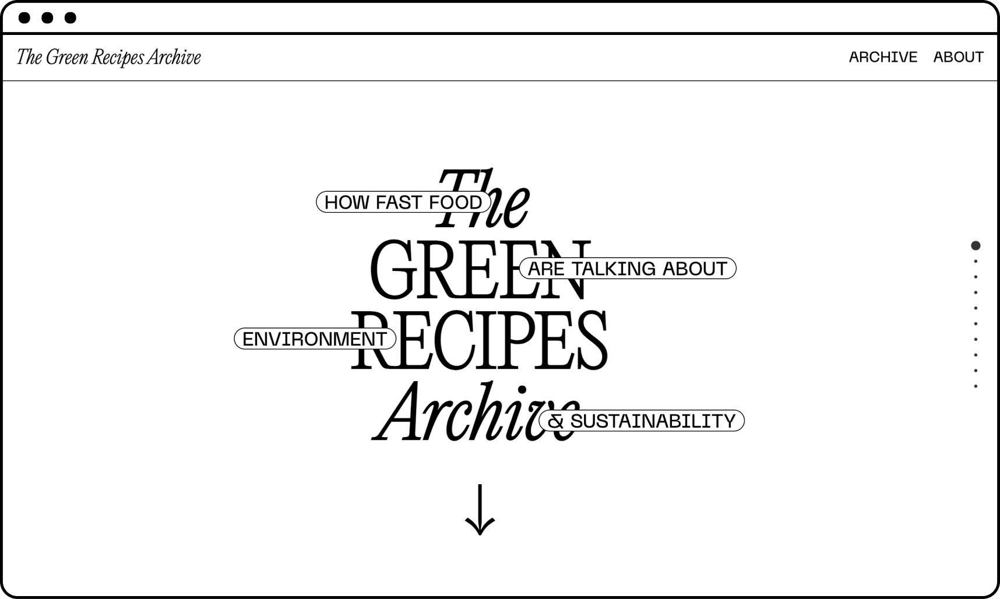
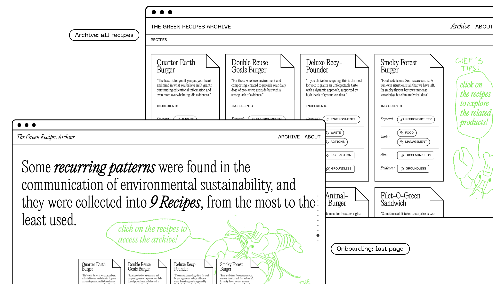

# The Green Recipes Archive
How fast food are talking about environment & sustainability

  

## Abstract
This archive permits to explore different kinds of green storytelling made by fast food companies and the common patterns behind them. By choosing each “recipe”, you can consult actual examples of sentences extracted from their websites. 

  

  

  

  

